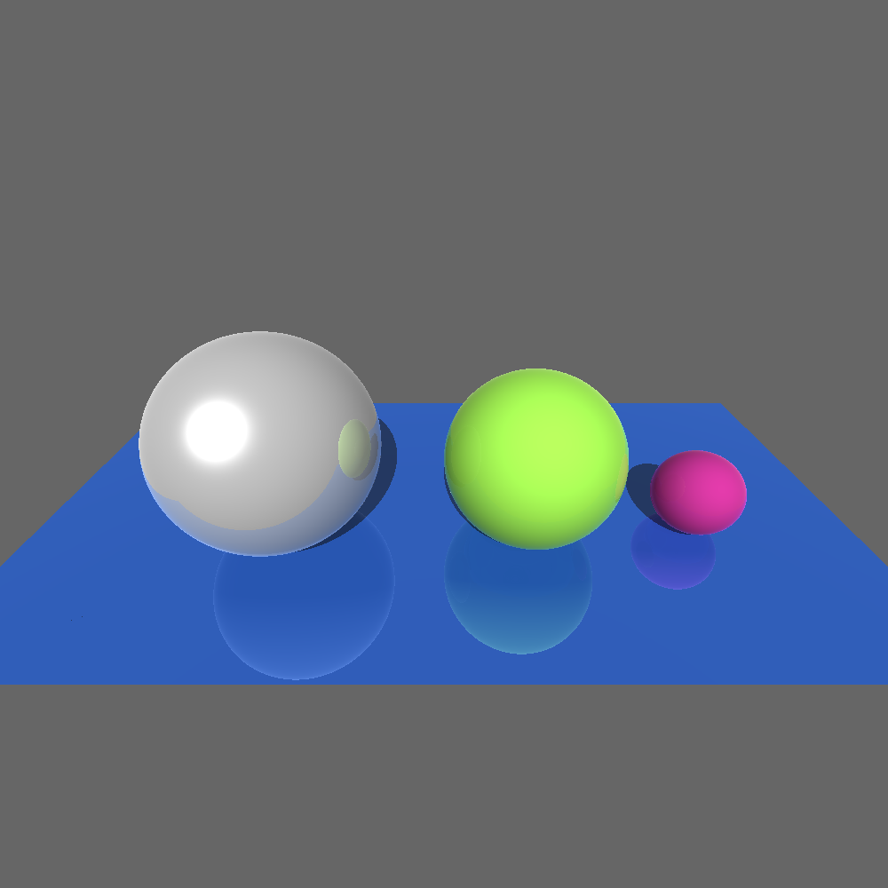
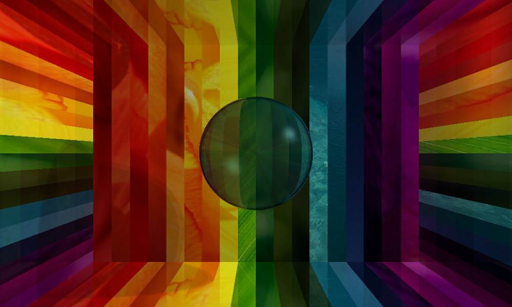
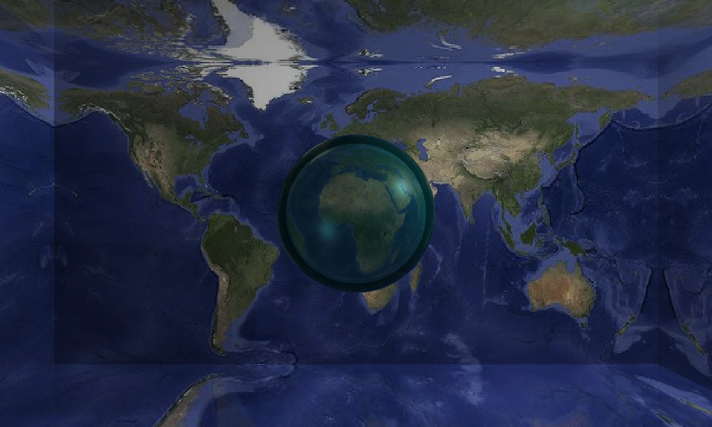
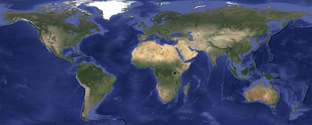

# C++ Recursive Ray Tracer


> **A custom, from-scratch 3D recursive ray tracer written entirely in C++ without external graphics APIs.**

## 📋 Overview
This project is an offline rendering engine built to simulate physically based light transport. Rather than relying on OpenGL or DirectX, this engine calculates pixel colors by mathematically casting rays from a virtual camera into a defined 3D scene, computing intersections with mathematical primitives, and simulating complex light bounces.

### Core Features Implemented
- **Recursive Ray Tracing:** Supports deep recursion for multi-bounce light paths (Reflection and Refraction).
- **Advanced Illumination:** Implements the extended **Phong Illumination Model** computing ambient, diffuse, and specular reflection components.
- **Geometric Intersections:** 
  - Mathematically precise Ray-Sphere intersections.
  - Ray-Triangle and Ray-Polygon intersections for arbitrary 3D meshes.
- **Material Properties:** Supports complex materials including colored diffuse, reflective metallic surfaces, and transmissive refractive materials (e.g., glass, water).
- **Scene Parsing:** Custom parser to read `.txt` scene description files containing camera configurations, multiple light sources, vertex coordinates, and material definitions.

## 🚀 Visual Demo
Each of the images below was directly rendered natively by this engine by parsing the corresponding `.txt` geometric parameter files.

<p align="center">
  
  
</p>
<p align="center">
  
  
</p>

## 🛠️ Technical Implementation Details
The ray tracer is built around a robust mathematical core:
- Custom 3D Vector and Matrix algebra classes.
- Barycentric coordinate calculation for polygon intersection testing.
- Snell's Law implementation for calculating physically accurate refraction vectors.
- Output generation natively exporting to the `PPM` image format.

## 🏃‍♂️ Usage

### Compilation
A `Makefile` is provided for easy compilation on Linux/Mac or using MSYS2 on Windows.
```bash
make
```

### Running a Scene
The compiled executable takes a `.txt` scene definition file as input.
```bash
./out test0.txt
```
This command parses the scene geometry and light setup, renders the image, and outputs a corresponding `test0.ppm` file.

## 📂 Project Structure
- `HW1d.cpp`: The core ray tracing engine containing the intersection math, recursive color calculation, and the `main` rendering loop.
- `test*.txt`: Example 3D scenes defining geometry, materials, and lights.
- `*.ppm`: The uncompressed image outputs generated by the renderer.
